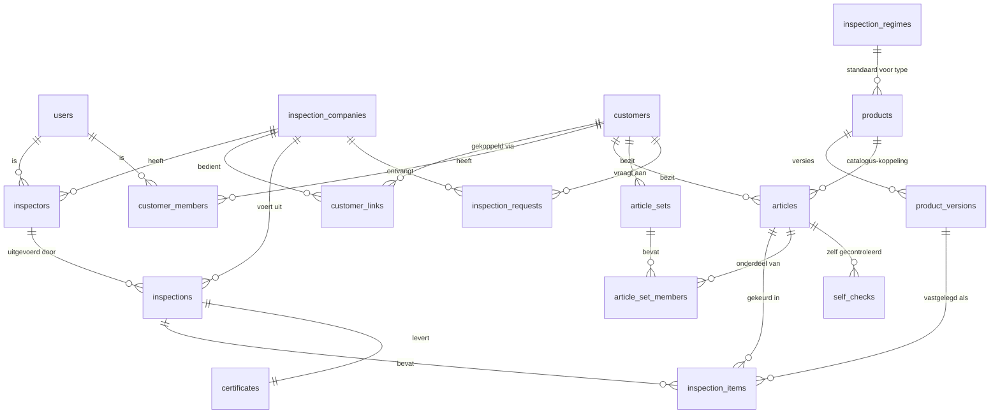

# Datamodel KlimKeur 2.0 — voorstel v6

Hoort bij `BLAUWDRUK.md`. Schema- en kolomnamen in het **Engels** (besloten),
uitleg in het Nederlands. Status: **voorstel, ter bespreking**.
(v3, 2026-06-12: verfijningen uit het bronnenonderzoek
`ONDERZOEK-CERTIFICAATEISEN.md` — keuringslocatie en -soort, aankoopdatum,
kwalificaties van keurmeesters mét upload, verkort interval bij zwaar
gebruik, certificaat-verificatie (QR + audit-trail), bewaarbeleid.
Resultaat blijft goed/afgekeurd.)
(v5, 2026-06-19: catalogusfilter per keurbedrijf toegevoegd — `allowed_norms` en `allowed_product_types` op `inspection_companies`. Keurbedrijf stelt eenmalig in welke normen EN types relevant zijn; alle keurmeesters zien automatisch gefilterde catalogus. Buiten de filter = volledig verborgen.)
(v6, 2026-06-19: extra productvelden toegevoegd aan `products` vanuit brondata CSV — `working_load_limit`, `max_user_weight_kg`, `rope_diameter_min_mm`, `rope_diameter_max_mm`, `serial_number_location`. `inspection_interval_years` uit CSV wordt `interval_override_months` in het model. `created_by` verduidelijkt: wie het product aan de bibliotheek toevoegde.)

## Eigendomsgrenzen (de kern, besloten)

Twee werelden die nooit door elkaar lopen:

1. **`products` — "de winkel".** De bron-database met alle producttypes.
   Eigendom van het platform; alléén platformbeheer en god-keurmeesters
   kunnen erin schrijven. Klanten en keurbedrijven kiezen eruit; wat zij
   aandragen komt hooguit als `pending` in de wachtrij en wordt pas
   winkelproduct als een god-keurmeester het promoveert.
2. **`articles` — de fysieke exemplaren van de klant.** Eigendom van de
   klant. De klant bepaalt via `customer_links` met welk(e)
   keurbedrijf/keurbedrijven hij ze deelt, en desgewenst welk déél
   (scope per producttype).

Leeswijzer: `PK` = primary key, `FK →` = verwijzing, `?` = mag leeg zijn.
Elke tabel krijgt standaard `id uuid PK`, `created_at timestamptz` — die
worden hieronder niet herhaald.

---

## Overzicht (ER-diagram)

---

## 1. Identiteit en rollen

### `users`
Profiel bovenop Supabase Auth. Eén persoon = één account, rollen volgen uit
de koppeltabellen (`inspectors`, `customer_members`, `platform_admins`).

| kolom | type | uitleg |
|---|---|---|
| auth_user_id | uuid, uniek | koppeling naar Supabase Auth |
| full_name | text | |
| email | text | |
| phone | text? | |
| locale | text | `nl` / `en-GB` — bepaalt UI-taal |

### `platform_admins`
| kolom | type | uitleg |
|---|---|---|
| user_id | FK → users | jij/platformbeheer; mag alles |

### `inspection_companies` (keurbedrijven, de tenants)
| kolom | type | uitleg |
|---|---|---|
| name | text | |
| country_code | text | `NL` / `GB` — stuurt regime, certificaatteksten, locale-defaults |
| registration_number | text? | KvK / Companies House — label volgt uit country_code |
| address, postal_code, city | text? | |
| email, phone | text? | |
| logo_url, brand_color | text? | branding in klant-app |
| cert_header, cert_footer | text? | vrije certificaatteksten |
| settings | jsonb | kolomweergave e.d. (nu `instellingen`-tabel) |
| invite_code | text, uniek | uitnodigingscode/QR voor eigen klanten |
| listed | boolean | de schakelaar "open voor nieuwe klanten" |
| allowed_norms | text[] | welke normen dit bedrijf keurt, bijv. `["EN", "ANSI", "AS"]` — catalogus filtert hier automatisch op; keurmeesters zien alleen producten binnen deze normen |
| allowed_product_types | text[] | welke types dit bedrijf keurt, bijv. `["ppe", "rigging"]` — zelfde filterlogica; leeg = alles zichtbaar |
| billing_status | text | `active` / `past_due` / `suspended` — past_due ⇒ automatisch van de lijst |
| stripe_customer_id | text? | facturatie |

> **Implementatie fase 2.5 (2026-06-24):** `address`, `postal_code`, `city`,
> `email`, `phone`, `cert_header`, `cert_footer` zijn als kolommen toegevoegd
> (migratie `20260624_certificates.sql`) zodat de PDF-kop/-voet iets te tonen
> heeft; leeg blijft prima, de PDF valt dan terug op een kale juridische
> standaardtekst. **Ingevuld (2026-06-25):** het enige bestaande bedrijf is
> bijgewerkt naar de echte gegevens van **Safety Green B.V.** — naam, adres
> (Energieweg 3, 6662NS Elst (Gld)), e-mail (jos@safetygreen.nl, telefoon nog
> niet aangeleverd), en de echte kop-/voettekst (kwalificatie-/
> aansprakelijkheidstekst resp. leveringsvoorwaarden/KvK-inschrijving) — zie
> `supabase/migrations/20260625_company_details_and_rejection_codes.sql`.
> `logo_url`/`brand_color`/`registration_number`/`allowed_norms`/
> `allowed_product_types`/`billing_status`/`stripe_customer_id` zijn nog niet
> aangelegd.

### `inspectors` (keurmeesters)
| kolom | type | uitleg |
|---|---|---|
| company_id | FK → inspection_companies | |
| user_id | FK → users | |
| is_admin | boolean | keurbedrijf-admin: beheert keurmeesters, klanten, instellingen |
| is_catalog_curator | boolean | de "god"-rol: mag globale catalogus bewerken |
| active | boolean | telt alleen actief mee voor het abonnement |

### `inspector_qualifications` (kwalificatiebewijzen, idee Jos 2026-06-12)
Upload van certificaten per keurmeester (Sachkundenachweis, IPAF,
fabrikantencertificaten). Klanten kunnen ze inzien (vertrouwen), het
certificaat vermeldt de juiste kwalificatie (VK-eis, DE-eis), en het systeem
waarschuwt bij verlopen.

| kolom | type | uitleg |
|---|---|---|
| inspector_id | FK → inspectors | |
| name | text | bijv. "Sachkunde PSAgA (DGUV 312-906)", "IPAF CAP" |
| number | text? | certificaat-/pasnummer |
| valid_until | date? | herinnering vóór verlopen |
| storage_path | text? | PDF/foto in Supabase Storage |

### `customers` (klantbedrijven én zelfstandige gebruikers)
Eigenaar van artikelen en historie (besloten: de klant bezit de data).

| kolom | type | uitleg |
|---|---|---|
| name | text | bedrijfsnaam of persoonsnaam — **verplicht** in het invoerformulier |
| customer_number | text? | eigen klantnummer (toegevoegd 2026-06-23) |
| kvk_number | text? | KvK-nummer (toegevoegd 2026-06-23) |
| vat_number | text? | BTW-nummer (toegevoegd 2026-06-23) |
| contact_person | text? | contactpersoon (toegevoegd 2026-06-23) |
| email | text | **verplicht** in het invoerformulier (basis voor latere magic-link-uitnodiging) |
| phone | text? | |
| street | text? | straat — adres opgesplitst (2026-06-23), vervangt `address` |
| house_number | text? | huisnummer (2026-06-23) |
| house_number_addition | text? | toevoeging, bv. A / bis (2026-06-23) |
| postal_code | text? | postcode |
| city | text? | woonplaats |
| province | text? | provincie (toegevoegd 2026-06-23) |
| country | text? | land, vrije tekst (toegevoegd 2026-06-23, naast `country_code`) |
| notes | text? | opmerkingen |
| type | text | `company` / `individual` — kolom bestaat nog, maar **niet meer in het inspector-invoerformulier** (besloten 2026-06-23) |
| country_code | text | legacy; de UI gebruikt nu het vrije tekstveld `country` |
| address | text? | **niet meer gebruikt** — vervangen door `street`/`house_number` (2026-06-23) |
| invite_code | text, uniek | uitnodigingscode/QR voor nieuwe medewerkers (besloten 2026-06-14, zie onboarding bij `customer_members`) |

> **Implementatie fase 2.2 (2026-06-23):** bovenstaande extra velden zijn als
> kolommen toegevoegd via `supabase/migrations/20260622_customers_extra_fields.sql`
> in de Gearonimo-repo. Alleen `name` en `email` zijn in de UI verplicht; de rest
> is vrije invoer (data-minimalisatie/AVG).

### `customer_members` (medewerkers/eindgebruikers)
| kolom | type | uitleg |
|---|---|---|
| customer_id | FK → customers | |
| user_id | FK → users | iedere medewerker heeft een eigen account (besloten 2026-06-14, zie onboarding hieronder) |
| name | text | weergavenaam ("gebruiker" van een artikel) |
| role | text | `manager` (beheeracties: medewerkers, `customer_links`, abonnement) / `end_user` |
| active | boolean | uit dienst ⇒ inactief, historie blijft |

**Onboarding (besloten 2026-06-14):** geen gedeeld wachtwoord en geen
"kies je naam"-systeem. Elke medewerker logt in met een eigen
**wachtwoordloos account** (Sign in with Apple/Google of magic-link via
e-mail) en koppelt zich via een **uitnodigingscode/QR/link** van het
klantbedrijf (`customers.invite_code`, zelfde patroon als
`inspection_companies.invite_code`) — dit maakt automatisch een
`customer_members`-rij aan (`role='end_user'`). Zo heeft elke `manager`/
`end_user` een echte identiteit, nodig voor het rolverschil en voor
attributie (`article_notes.author_member_id`, zie §3).

**Zichtbaarheid (besloten 2026-06-14):** `role` bepaalt alleen **beheerrechten**
(medewerkers toevoegen/verwijderen, `customer_links` beheren, abonnement) —
niet de zichtbaarheid van materiaal. Zowel `manager` als `end_user` zien
**alle `articles` van hun `customer_id`**, inclusief `assigned_member_id`
(aan wie toegewezen). RLS-policy: scope op `customer_id`, niet op
`assigned_member_id`. Voor bewerkrechten op artikelen, zie §3.

**Geen limiet op het aantal managers (besloten 2026-06-14):** een
`customer_id` mag meerdere `customer_members` met `role='manager'` hebben.
Grote klantbedrijven kunnen zo bijv. een magazijnbeheerder aanwijzen naast
de eigenaar, zonder apart rolniveau.

> **Implementatie fase 2.3 (2026-06-23, inspector-app):** eerste slice is
> simpeler dan bovenstaand model: `customer_members` heeft nu `name`, `role`
> (vrije tekst, geen `manager`/`end_user`-onderscheid), `phone`, `email`,
> `notes`, `active`. Géén `user_id`/eigen account en géén
> uitnodigingscode-onboarding — de keurmeester voert medewerkers zelf in
> (zelfde aanpak als `assigned_user_name` op `articles`: eerst vrij invullen,
> later pas de echte koppeling). Migratie:
> `supabase/migrations/20260623_customer_members.sql`. RLS uit, GRANT aan
> `authenticated`, zelfde tijdelijke opzet als `customers`/`articles`.
> `articles.assigned_member_id` en `article_sets.created_by_member_id` wijzen
> nog niet naar deze tabel (blijven losse uuid-kolommen tot de koppeling
> gebouwd wordt).

### `customer_links` (koppeling klant ↔ keurbedrijf)
De wisselbare relatie; historie blijft bewaard bij overstap. **Meerdere
actieve links tegelijk zijn toegestaan** (besloten 2026-06-12): bijv. PPE
bij keurbedrijf A, machines (kettingzagen, accuboren, versnipperaars) bij
keurbedrijf B.

| kolom | type | uitleg |
|---|---|---|
| customer_id | FK → customers | |
| company_id | FK → inspection_companies | |
| customer_number | text? | het eigen klantnummer van het keurbedrijf |
| scope_product_types | text[]? | leeg = alle artikelen zichtbaar; gevuld = alleen artikelen van deze producttypes (de klant bepaalt wat hij deelt) |
| status | text | `pending` / `active` / `ended` |
| started_at, ended_at | timestamptz? | |

---

## 2. Catalogus en regimes

### `products` (globale catalogus — nu nog per bedrijf, wordt platformbreed)
| kolom | type | uitleg |
|---|---|---|
| brand | text | merk |
| name | text | omschrijving |
| product_type | text | `ppe` / `rigging` / `aerial_platform` / `machine` (kettingzaag, accuboor, versnipperaar) / `other` / … — bepaalt standaardregime |
| category | text? | huidige `categorie` |
| material | text? | |
| standard | text? | EN-norm (huidige `norm`) |
| max_age_years | int? | kalenderleeftijd (huidige `max_leeftijd`) |
| max_age_use_years | int? | vanaf ingebruikname (`max_leeftijd_use`) |
| max_age_mfr_years | int? | fabrikantentermijn (`max_leeftijd_mfr`) |
| breaking_strength | text? | breuksterkte |
| working_load_limit | text? | maximale werklast (WLL) |
| max_user_weight_kg | int? | maximaal gebruikersgewicht in kg |
| rope_diameter_min_mm | numeric? | minimale touwdiameter in mm (voor apparaten die op touw werken) |
| rope_diameter_max_mm | numeric? | maximale touwdiameter in mm |
| serial_number_location | text? | waar het serienummer te vinden is op het product, bijv. "label aan binnenkant gordel" |
| manufacturer_code | text? | artikel-/modelcode van de fabrikant (bv. Petzl-bestelnummer) — besloten 2026-06-14, los van het eigen `id` en van `serial_number` op `articles` (exemplaar van de klant). Formaat verschilt per fabrikant; structuur evt. verfijnen zodra fabrikant-datafeeds binnenkomen (zie `manufacturer-outreach-email.md`) |
| manual_url | text? | link naar PDF-handleiding |
| product_page_url | text? | link naar productpagina van de fabrikant |
| recall_url | text? | link naar recall-bericht. Bewust géén automatische waarschuwing aan eigenaren (besloten 2026-06-12): recalls gelden vrijwel altijd voor déélreeksen (serienummers van–tot, productiejaar, vóór/na datum) die een systeem niet betrouwbaar kan interpreteren — vals alarm of schijnveiligheid. In plaats daarvan: de app toont de recall als vlag aan de **keurmeester tijdens de keuring** van een gekoppeld artikel ("controleer of dit serienummer eronder valt"); beoordeling blijft mensenwerk. De recall-zoekfunctie uit KlimKeur Pro blijft als feature |
| inspection_notice_url | text? | link naar inspection notice / veiligheidsbulletin van de fabrikant; zelfde vlag-gedrag als recall_url |
| notes | text? | bijzonderheden |
| interval_override_months | int? | wijkt af van het regime voor dit product |
| status | text | `approved` / `pending` (wachtrij) / `rejected` / `archived` |
| created_by | FK → users | wie hem aandroeg (klant of curator) |

**Meertaligheid catalogus (besloten 2026-06-14):** `brand` en `name` zijn
internationaal (merk/modelnaam, bv. "Petzl Avao Bod") en blijven ongemoeid.
`product_type` en `category` zijn een kleine, beheerde lijst en worden — net
als `rejection_codes.label_key` — als **i18n-sleutel** vertaald (NL/EN/DE) in
de taalbestanden, inclusief een sleutel `other`/`overig` voor artikelen die
nergens in passen (bv. iemands eigen computer). Dit is alléén relevant voor de
**globale catalogus** (`status='approved'`); een **vrij artikel**
(`free_description`/`free_brand`/`free_material` op `articles`, zie §3)
blijft altijd vrije tekst in de eigen taal van de klant, ongeacht categorie —
invoer mag nooit blokkeren op classificatie.

### `product_versions` (versiegeschiedenis — juridisch anker)
Bij elke wijziging van een `approved` product wordt een versie weggeschreven.
Keuringsitems verwijzen naar de versie, zodat een certificaat altijd de
productdata van de keuringsdatum toont.

| kolom | type | uitleg |
|---|---|---|
| product_id | FK → products | |
| version_no | int | oplopend |
| data | jsonb | volledige snapshot van alle productvelden |
| changed_by | FK → users | welke curator |
| change_note | text? | waarom |

### `inspection_regimes` (interval per type × markt)
| kolom | type | uitleg |
|---|---|---|
| product_type | text | |
| country_code | text | |
| interval_months | int | NL/ppe → 12; GB/ppe → 6; NL/machine → 12 (NEN 3140); nieuw land of type = rijen toevoegen |
| severe_use_interval_months | int? | verkort interval bij zwaar gebruik (VK/INDG367: 3 mnd bij bijv. scherpe randen); artikel krijgt vlag `severe_use` |
| legal_reference | text? | "Arbobesluit" / "LOLER 1998" / "NEN 3140" / "DGUV Regel 112-198" — op certificaat |

Intervalresolutie: artikel-override → product-override → regime(type × land).

> **Implementatie fase 2.5 (2026-06-24):** geen eigen DB-tabel — leeft als
> statische `REGIMES`-lijst in `packages/core/src/regimes.ts` (NL/GB ×
> ppe/rigging/machine/aerial_platform), met `getLegalReference()` als
> nieuwe helper die het certificaat-PDF voedt. Een DB-tabel is pas nodig
> zodra een keurbedrijf eigen regimes/landen moet kunnen instellen.

### `rejection_codes` (afkeurcodes)
| kolom | type | uitleg |
|---|---|---|
| company_id | FK? → inspection_companies | leeg = platformstandaard (vertaald via i18n-sleutel), gevuld = eigen code van het keurbedrijf |
| code | int | huidige codes 1–8 blijven |
| label_key | text? | i18n-sleutel voor standaardcodes |
| label | text? | vrije tekst voor eigen codes |
| active | boolean | |

> **Implementatie fase 2.5 (2026-06-25):** de 8 codes zijn ingevuld als
> platformstandaard (`company_id = null`), aangeleverd door Jos uit de
> huidige praktijk: 1 slijtage/opgebruikt, 2 mechanisch beschadigd,
> 3 brand- of smeltplekken, 4 roest, 5 leeftijd of label, 6 defecte sluiting,
> 7 modificatie, 8 anders/zie opmerkingen — als vrije tekst in `label`
> (`label_key`/i18n-vertaling nog niet gebruikt). Migratie:
> `supabase/migrations/20260625_company_details_and_rejection_codes.sql`.
>
> **Instellingenscherm toegevoegd + per keurbedrijf (besluit Jos 2026-06-25):**
> afkeurcodes zijn nu via de UI te beheren onder de Instellingen-tegel
> (`apps/inspector/src/components/RejectionCodes.vue`): toevoegen, wijzigen en
> aan-/uitzetten. Codes zijn **per keurbedrijf** instelbaar: elk bedrijf
> beheert zijn eigen, losse set (`company_id` = bedrijf), volledig onafhankelijk
> van andere bedrijven. De platformstandaard (`company_id` leeg) blijft staan
> als **sjabloon/fallback**: een bedrijf zonder eigen codes valt daarop terug
> (zie `fetchRejectionCodes` in `useInspections.ts`) en krijgt bij de eerste
> opening van het instellingenscherm automatisch een eigen kopie geseed.
> Bestaande bedrijven zijn via migratie
> `20260627_rejection_codes_per_company.sql` (idempotent) van een eigen kopie
> voorzien. In de UI dus geen platform/eigen-onderscheid meer — alle getoonde
> codes zijn van het bedrijf zelf, vrij te bewerken/verwijderen. De gedeelde
> platformrijen worden níét meer door een keurbedrijf ter plekke bewerkt.

---

## 3. Artikelen (het bezit van de klant)

### `articles`

> **Implementatie 2026-06-23 (fase 2):** artikelen per klant live op het
> klantdetailscherm (inspector-app). Toevoegen via **catalogus-zoeken**
> (fuzzy/typo-tolerant, DB-functie `search_products` met `pg_trgm`) + merkfilter
> met autocomplete en toetsenbordnavigatie; gekozen product koppelt via
> `product_id`. Fallback "vrij artikel" (`free_*` + `suggest_for_catalog`).
> Migraties: `20260623_articles.sql` (tabel + grant) en `20260623_search_products.sql`
> (functie + FK `articles.product_id → products`). RLS uit, grant `authenticated`.
> NB: `search_products` zat eerder alleen in de DB (niet in de repo) en is nu
> vastgelegd als migratie.
>
> **Aanvulling 2026-06-23:** toevoegformulier heeft nu ook gebruiker,
> ingebruikname-datum, set en opmerkingen. `first_use_date`/`notes` = bestaande
> kolommen. **Tijdelijk** als vrije tekst toegevoegd (migratie
> `20260623_article_extra_fields.sql`): `assigned_user_name` (wordt later
> `assigned_member_id → customer_members`) en `set_label` (wordt later de echte
> `article_sets`-tabel).
>
> **Keuringstabel (2026-06-26):** `assigned_user_name` is nu ook een
> bewerkbare kolom in de keuringswizard (niet alleen op het
> artikeldetailscherm); handleiding-link en recall-vlag (zie
> `free_manual_url`/`free_recall_flag`/`free_recall_url` hierboven) zijn daar
> ook zichtbaar/bewerkbaar geworden. De native browser-`<datalist>` voor
> Artikel/Merk/Categorie/Serienummer is vervangen door een eigen, niet-
> zwevende suggestielijst (loste op dat de native dropdown over de tabel
> heen viel); elk veld zoekt nu strikt in zijn eigen bron in plaats van alle
> velden tegelijk in de catalogus.
>
> **Artikeldetailscherm 2026-06-23:** `/articles/:id` (vanuit de klantenlijst
> aanklikbaar) toont/bewerkt nu ook bouwjaar/-maand, aankoopdatum en
> severe_use; `first_use_date` is eenmalig invulbaar (daarna alleen-lezen, zie
> bewerkrechten hieronder). Geen harde delete: "afvoeren" zet
> `retired=true`/`retired_at` (data blijft bewaard). Nog niet in de UI:
> interval-override, het wisselen van gekoppeld catalogusproduct.

| kolom | type | uitleg |
|---|---|---|
| customer_id | FK → customers | de eigenaar |
| product_id | FK? → products | leeg = "vrij artikel" (nog niet in catalogus); komt pas in de wachtrij als `suggest_for_catalog=true` |
| free_description, free_brand, free_material | text? | alleen gevuld bij vrij artikel |
| free_manufacturer_code, free_manual_url | text? | idem, alleen bij vrij artikel — verplicht zodra `suggest_for_catalog=true` (zie hieronder) |
| free_recall_flag | boolean | **toegevoegd 2026-06-26** — handmatige recall-vlag voor een vrij artikel (geen `product_id`); de keurmeester zet deze zelf aan/uit in de keuringstabel, met een prompt voor `free_recall_url`. Catalogusproducten hebben dit niet nodig: die gebruiken het bestaande `products.recall_url` |
| free_recall_url | text? | idem, het bijbehorende recall-bericht-linkje bij een vrij artikel |
| serial_number | text? | |
| manufacture_year | int? | |
| manufacture_month | int? | |
| purchase_date | date? | aankoopdatum (EN 365-registratieveld) |
| first_use_date | date? | huidige `in_gebruik` |
| assigned_member_id | FK? → customer_members | de "gebruiker"; leeg = poolmateriaal |
| interval_override_months | int? | per artikel afwijken |
| severe_use | boolean | zwaar gebruik → verkort interval uit het regime (VK) |
| notes | text? | algemeen vrij veld, los van de tijdlijn in `article_notes` |
| retired | boolean | afgevoerd |
| retired_at | timestamptz? | |
| suggest_for_catalog | boolean | klant-vinkje "voeg toe aan de productendatabase" bij een vrij artikel (`product_id` leeg) — besloten 2026-06-14, zie BLAUWDRUK §2. Aangevinkt: artikel komt in de catalogus-wachtrij (`products`, status=`pending`) en `free_description`/`free_brand`/`free_manual_url` worden verplicht. Niet aangevinkt: blijft puur eigen artikel, buiten de wachtrij |
| self_managed | boolean | `true` = vrij, niet-PBM artikel uit de "zelf te keuren spullen"-lijst (EHBO-trommel, brandblusser, auto-APK, kettingzaag bij externe dealer, …) — besloten 2026-06-14, zie BLAUWDRUK §2. Staat los van de catalogus (`product_id` leeg) en komt nooit in de keuring-wizard van een keurmeester, ook niet via een actieve `customer_link`. Status volgt uit `self_checks` i.p.v. `inspection_items` |

Status (groen/oranje/"nog niet gekeurd"/rood) wordt **berekend**, nooit
opgeslagen: de "volgende keuring uiterlijk"-datum (`next_due`) van de laatste
afgeronde keuring — de vroegste van keuringsdatum + interval én einde
levensduur, eventueel handmatig aangepast door de keurmeester. Einde
levensduur kan dus eerder rood geven dan het keuringsinterval. Nooit gekeurd ⇒
"vraag een keuring aan" (geen rood alarm, zie blauwdruk §7).
Terminologie bewust: nergens "goed tot" — een keuring is een momentopname,
geen garantie tot een datum.

Poolmateriaal (besloten 2026-06-12): `assigned_member_id` leeg is normaal
gebruik — voorraad en niet-PPE hebben zelden een vaste gebruiker, en gedeelde
PPE komt in de praktijk voor. De app straft dit niet af; bij PPE zonder vaste
gebruiker toont de UI alleen een vriendelijke hint dat PPE persoonlijk is en
bij één persoon hoort.

**Bewerkrechten (besloten 2026-06-14):** zowel `manager` als `end_user` mogen
een nieuw artikel toevoegen, `first_use_date` invullen (eenmalig, daarna niet
meer wijzigbaar) en een artikel afvoeren (`retired=true` + `retired_at`, data
blijft bewaard). Opmerkingen plaatsen (zie `article_notes` hieronder) mag een
`end_user` alleen bij artikelen met `assigned_member_id` = zichzelf; een
`manager` mag dit bij elk artikel van de `customer_id`. Keuringen blijven
uitsluitend voor keurmeesters (Pro-app, niet Klant-app).

### `article_notes` (opmerkingen, besloten 2026-06-14)
Kleine, append-only lijst met opmerkingen per artikel — voorkomt dat
meerdere mensen elkaars aantekening overschrijven (in tegenstelling tot het
losse `notes`-veld op `articles`).

| kolom | type | uitleg |
|---|---|---|
| article_id | FK → articles | |
| author_member_id | FK → customer_members | automatisch de ingelogde gebruiker, niet vrij invulbaar |
| text | text | |
| created_at | timestamptz | |

### `article_sets` (sets / samengestelde uitrustingen, besloten 2026-06-19)
Een set is een **groepering** van losse artikelen die bij elkaar horen, zoals
een fliplijn (lijmklem + lijn + karabiner(s)) of een klimgordel met extra
ring. De set heeft geen eigen serienummer en geen eigen keuring — elk
onderdeel behoudt zijn eigen `articles`-rij, eigen SN en eigen
keuringsuitslag. De set is puur organisatorisch: het helpt de gebruiker en
keurmeester om bij elkaar horende artikelen in één oogopslag te zien.

Spelregels (besloten 2026-06-19):
- Een artikel mag in meerdere sets zitten (een karabiner die ook los bestaat).
- Een set verwijderen verwijdert de losse artikelen **niet** — alleen de
  groepering verdwijnt.
- Keuring van onderdelen is altijd per artikel; één afgekeurd onderdeel
  maakt niet automatisch de hele set afgekeurd.
- Sets zijn zichtbaar voor zowel de klant als de keurmeester (via de
  actieve `customer_link`).
- Aanmaken mag door zowel de klant (`manager` of `end_user`) als de
  keurmeester (besloten 2026-06-19).

| kolom | type | uitleg |
|---|---|---|
| customer_id | FK → customers | eigenaar van de set |
| name | text | bijv. "Fliplijn Jan", "Gordel + extra ring Piet" |
| notes | text? | vrij veld voor toelichting |
| created_by_member_id | FK? → customer_members | gevuld als een klantgebruiker de set aanmaakt |
| created_by_inspector_id | FK? → inspectors | gevuld als een keurmeester de set aanmaakt |

### `article_set_members` (koppeltabel: welke artikelen zitten in een set)
| kolom | type | uitleg |
|---|---|---|
| set_id | FK → article_sets | |
| article_id | FK → articles | het losse artikel |
| role | text? | optionele omschrijving van de rol in de set: "lijn", "lijmklem", "karabiner", "extra ring", … — vrije tekst, geen vaste lijst |

> **Implementatie 2026-06-23 (fase 2):** `article_sets` +
> `article_set_members` live (migratie `20260623_article_sets.sql`, RLS uit,
> grant `authenticated`). UI: op het klantdetailscherm een set aanmaken
> (naam + artikelen aanvinken uit de bestaande lijst van de klant);
> `/sets/:id` toont de leden, laat artikelen toe/verwijderen uit de set en
> de set hernoemen/verwijderen (verwijdert nooit de onderliggende
> artikelen). `created_by_member_id`/`created_by_inspector_id` staan al in
> de tabel maar worden nog niet gevuld (`customer_members`/`inspectors`
> bestaan nog niet). `role` per lid en de uitklapbare statuskaart
> (slechtste status van de leden) zijn nog niet gebouwd.

**UI-weergave:** een set toont als een uitklapbare kaart. Bovenin de naam
van de set; uitklappen toont elk onderdeel met zijn eigen statusindicator
(groen/oranje/rood). De slechtste status van de onderdelen bepaalt de kleur
van de set-kaart — zo valt een afgekeurd onderdeel meteen op zonder dat je
hoeft uit te klappen.

### `self_checks` (zelf gecontroleerd, besloten 2026-06-14)
Voor artikelen met `self_managed=true` (zie hierboven): de klant meldt zelf
af, eventueel met bijlage van een extern keuringsrapport. Staat volledig los
van `inspections`/`certificates` (keurmeester-only, juridisch onveranderlijk,
zie §4/§10) — dit is informeel en door de klant zelf ingevuld.

| kolom | type | uitleg |
|---|---|---|
| article_id | FK → articles | moet `self_managed=true` zijn |
| checked_at | date | |
| performed_by | text? | vrije tekst, bv. "Stihl-dealer Jansen", "garage Peters (APK)", "eigen controle" — géén koppeling met `inspection_companies` |
| next_due | date? | door gebruiker ingevuld |
| attachment_url | text? | optioneel eigen geüpload bestand (extern rapport/bonnetje) |
| created_by_member_id | FK → customer_members | |

Status/`next_due` van een `self_managed`-artikel volgt uitsluitend uit
`self_checks`. De UI toont dit duidelijk anders ("zelf afgemeld op …") dan
een keurmeester-certificaat, om verwarring over de juridische status te
voorkomen.

---

## 4. Keuringen en certificaten

### `inspections` (keuringen)
| kolom | type | uitleg |
|---|---|---|
| customer_id | FK → customers | |
| company_id | FK → inspection_companies | wie keurde (blijft historisch staan na overstap) |
| inspector_id | FK → inspectors | |
| certificate_number | text | |
| inspection_date | date | |
| location | text? | locatie van de keuring (LOLER/WAHR-rapportveld) |
| examination_type | text | `periodic` / `interim` / `after_event` / `pre_first_use` (BetrSichV §14, INDG367) |
| status | text | `draft` / `completed` — na completed onveranderlijk |
| completed_at | timestamptz? | |
| notes | text? | |

### `inspection_items`
| kolom | type | uitleg |
|---|---|---|
| inspection_id | FK → inspections | |
| article_id | FK → articles | |
| product_version_id | FK? → product_versions | productdata zoals op keuringsdatum |
| article_snapshot | jsonb | kopie van artikelvelden op keuringsdatum (serienummer, gebruiker, …) — volledig onveranderlijk dossier |
| result | text | `passed` / `rejected` / `not_assessed` |
| next_due | date? | "volgende keuring uiterlijk" (maandprecisie) — bewust níet "goed tot": een keuring is een momentopname, geen garantie. Soms verloopt de levensduur vóór het interval; systeem stelt automatisch de vroegste voor van (keuringsdatum + interval) en (einde levensduur uit productdata: bouwjaar + max. leeftijd, of eerste gebruik + max. gebruiksduur); keurmeester kan handmatig aanpassen |
| rejection_code_id | FK? → rejection_codes | |
| comment | text? | |

> **Implementatie fase 2.4 (2026-06-24, inspector-app):** `inspections` en
> `inspection_items` zijn nu gebouwd zoals hierboven, inclusief de
> next_due-berekening via `packages/core` (interval × bouwjaar/eerste-gebruik-
> begrenzing, zie §status/next_due-logica). Niet meegebouwd: `product_version_id`
> (er is nog geen `product_versions`-tabel — de productdata in `article_snapshot`
> is de huidige stand, niet een onveranderlijke versie). `certificate_number`
> wordt sinds fase 2.5 wel gezet. Om de wizard te kunnen draaien zijn ook
> `inspection_companies` en `inspectors` (met automatische provisionering per
> ingelogde gebruiker, geen apart beheerscherm) en `customer_links`
> (automatisch gekoppeld/backfilled) al volgens het volledige DATAMODEL
> aangelegd, ook al is er vandaag nog maar één keurbedrijf — zie de migraties
> `supabase/migrations/20260624_*.sql`.

### `photos` (besloten 2026-06-12: ja, met maat-discipline)
Foto's bij keuringsitems (bewijs bij afkeur) en optioneel bij artikelen.

| kolom | type | uitleg |
|---|---|---|
| inspection_item_id | FK? → inspection_items | óf dit |
| article_id | FK? → articles | óf dit |
| storage_path | text | Supabase Storage |
| taken_by | FK → users | |

Spelregels tegen traagheid en kosten: foto's worden **op het apparaat
verkleind vóór upload** (max ~1600 px, ±250 KB), maximum aantal per
keuringsitem (bijv. 3), thumbnails + lazy loading in de UI. Rekenvoorbeeld:
100.000 foto's ≈ 25 GB ≈ < €1/maand opslag bij Supabase — beheersbaar.
**Nog niet gebouwd** (stand 2026-06-24) — bewust na het certificaat-PDF,
zie BOUWPLAN.

### `certificates`
| kolom | type | uitleg |
|---|---|---|
| inspection_id | FK → inspections, uniek | |
| number | text | |
| storage_path | text | de vastgelegde PDF in Supabase Storage — wordt nooit opnieuw gegenereerd |
| language | text | taal van het document |
| issued_at | timestamptz | |
| pdf_hash | text | hash van het bestand (audit-trail: bewijs dat de PDF onveranderd is) |
| verify_token | text, uniek | voor de verificatie-QR op het certificaat: scan → publieke pagina toont het echte record |

Op de PDF staan verplicht: "volgende keuring uiterlijk" (LOLER-eis; per item
`next_due`, begrensd door einde levensduur — bewust niet "goed tot"), naam +
kwalificatie van de keurmeester, wettelijke basis
(`legal_reference`), handtekening (PNG) en de verificatie-QR. Voor de Duitse
markt later uitbreidbaar met een automatisch cryptografisch zegel
(eIDAS-niveau "geavanceerd", server-side, geen handeling voor de keurmeester).

> **Implementatie fase 2.5 (2026-06-24, inspector-app):** `certificates`
> gebouwd zoals hierboven (migratie `supabase/migrations/20260624_certificates.sql`),
> met twee bewuste afwijkingen t.o.v. het oorspronkelijke "server-side"-plan:
> de PDF wordt **client-side** gebouwd (`pdf-lib` + `qrcode` in
> `apps/inspector/src/composables/useCertificate.ts`) bij het afronden van de
> wizard (stap 4) — er is nog geen edge-function-infra, en de juridische
> onveranderlijkheid hangt af van "eenmalig gegenereerd + hash", niet van
> waar de generatie draait. De Storage-bucket `certificates` is **publiek**
> (leesbaar zonder account) met ongokbare uuid-paden — zelfde
> vertrouwensmodel als de `verify_token` in de QR-link; alleen
> `authenticated` mag uploaden. Verificatie loopt via de nieuwe
> `verify_certificate(token)`-RPC (security definer) die alleen de velden
> teruggeeft die op de publieke pagina nodig zijn (bedrijfsnaam, klantnaam,
> datum, items, hash) — niet de volledige klant-/keuringdata, want `anon`
> heeft geen rechten op `customers`/`inspections`/`inspection_items`. De
> publieke pagina zelf is `/verify/:token` in de inspector-app (geen apart
> publiek app'tje, kiss). `handtekening (PNG)` en het cryptografische
> DE-zegel zijn nog niet gebouwd; de wettelijke basis per item komt uit de
> statische `REGIMES`-lijst in `packages/core` (zie §`inspection_regimes`),
> niet uit een DB-tabel. Certificaatnummer-formaat: `JJJJMMDD-KLANTNAAM`
> (Jos' huidige praktijk).
>
> **Bedrijfsgegevens en afkeurcodes ingevuld (2026-06-25):** Safety Green
> B.V.'s echte bedrijfsgegevens en de 8 echte afkeurcodes zijn nu gezet (zie
> §`inspection_companies` en §`rejection_codes`). Migratie:
> `supabase/migrations/20260625_company_details_and_rejection_codes.sql`,
> uitgevoerd in Supabase.
>
> **Live op `main` (2026-06-25):** de feature-branch
> (`claude/quirky-darwin-blp1o8`) is fast-forward gemerged naar `main` en
> gepusht; https://gearonimo.net draait nu met de certificaat-functionaliteit
> (auto-deploy via GitHub Pages bij push naar `main`). **Stand: net live,
> eerste echte test (Jos rondt een keuring af en controleert het
> certificaat/QR/downloadlink) is nog niet teruggekoppeld — dat is de
> volgende stap.** Geen instellingenscherm voor afkeurcodes en geen foto's
> bij afkeuring (zie §`rejection_codes`/§`photos`) — bewust nog niet gebouwd.

---

## 5. Aanvragen (de leadmotor)

### `inspection_requests`
| kolom | type | uitleg |
|---|---|---|
| customer_id | FK → customers | |
| company_id | FK → inspection_companies | gekozen uit lijst, via code of naam-zoeken |
| source | text | `public_list` / `invite_code` / `name_search` / `switch` — meet wat de lijst oplevert |
| message | text? | |
| status | text | `pending` / `accepted` / `declined` / `withdrawn` |
| handled_at | timestamptz? | |

Bij `accepted`: `customer_link` wordt `active` (en een eventuele oude link
`ended`); het keurbedrijf ziet vanaf dan de artikelen en historie van de klant.

---

## 6. Facturatie

### `usage_counters`
| kolom | type | uitleg |
|---|---|---|
| company_id | FK → inspection_companies | |
| year | int | staffel per kalenderjaar |
| items_inspected | int | opgehoogd (trigger) bij afronden keuring; voedt Stripe metered billing: eerste 1.000 à €0,10, daarna €0,05 |

Abonnement (€5/keurmeester/maand) = telling van `inspectors.active` per
maand, ook naar Stripe. Geen verdere eigen boekhouding in de database.

**Niet-gekoppelde klantaccounts (besloten 2026-06-14):** voor de zachte
limiet uit BLAUWDRUK §7 (50 artikelen gratis, daarna optioneel €5/jaar per
200 extra of een vrijwillige bijdrage) volstaat `count(articles) where
customer_id = X` — geen aparte tellertabel nodig. Pas als dit qua
performance gaat knellen (onwaarschijnlijk bij dit aantal), voeg dan een
`customers.articles_count` toe die per insert/delete wordt bijgehouden.

---

## 7. Rechten per rol (RLS-schets)

| | platform_admin | catalog_curator | keurbedrijf-admin | keurmeester | klant-manager | end_user |
|---|---|---|---|---|---|---|
| Globale catalogus | beheer | beheer + wachtrij | lezen | lezen | lezen | lezen |
| Eigen keurbedrijf + keurmeesters | alles | — | beheer | lezen | — | — |
| Klanten van het keurbedrijf | alles | — | actieve links: lezen/keuren | actieve links: lezen/keuren | — | — |
| Artikelen van het klantbedrijf (`self_managed=false`) | alles | — | via actieve link | via actieve link | alle artikelen: beheer | alle artikelen: lezen + toevoegen/afvoeren/in-gebruikname |
| Sets (`article_sets` + `article_set_members`) | alles | — | via actieve link: lezen + aanmaken | via actieve link: lezen + aanmaken | alle sets van `customer_id`: beheer | alle sets van `customer_id`: lezen + aanmaken |
| Opmerkingen (`article_notes`) | alles | — | via actieve link: lezen | via actieve link: lezen | elk artikel | eigen toegewezen artikelen |
| "Zelf te keuren"-spullen (`self_managed=true`, `self_checks`) | alles | — | — | — | beheer | eigen toegewezen artikelen, zie §3 |
| Medewerkers van het klantbedrijf | alles | — | — | — | beheer | — |
| Keuringen + certificaten | alles | — | eigen bedrijf | eigen bedrijf | eigen klantbedrijf (alle) | eigen artikelen |
| Lijst-schakelaar, branding, instellingen | alles | — | beheer | — | — | — |

Kernregels: toegang van een keurbedrijf tot klantdata loopt áltijd via een
`customer_link` met status `active`, en alleen binnen de eventuele
deel-scope (producttypes) van die link; na overstap vervalt de inzage in nieuwe
data, maar de eigen uitgevoerde keuringen/certificaten blijven leesbaar
(eigen administratie). Afgeronde keuringen en certificaten zijn voor
niemand muteerbaar. Artikelen met `self_managed=true` (en hun `self_checks`)
zijn voor **geen enkel keurbedrijf/keurmeester** zichtbaar, ook niet via een
actieve `customer_link` met scope "alle producttypes" — dit is bewust een
volledig gescheiden, klant-only lijst (zie §3, BLAUWDRUK §2).

---

## 8. Migratie vanaf huidig schema (Safety Green)

| nu | wordt |
|---|---|
| `bedrijven` | `inspection_companies` |
| `keurmeesters` | `users` + `inspectors` |
| `klanten` | `customers` + `customer_links` (active) |
| `producten` (per bedrijf!) | `products` (globaal, status approved) + `product_versions` v1 |
| `keuringen` | `inspections` |
| `keuring_items` | `articles` (uniek per serienummer/klant) + `inspection_items` |
| `afkeurcodes` | `rejection_codes` |
| `instellingen` | `inspection_companies.settings` |
| klimkeur-klant accounts | `users` + `customer_members` |
| — (nieuw) | `article_sets` + `article_set_members` (geen migratie nodig: sets worden na lancering handmatig aangemaakt door klanten/keurmeesters) |

Aandachtspunt: in het huidige model zíjn artikelen geen eigen entiteit —
elk keuringsitem draagt de artikelgegevens. Het script moet dus artikelen
**afleiden** (groeperen op klant + serienummer) en de historie eraan hangen.

---

## 9. Vragen aan Jos — beantwoord 2026-06-12

1. ~~Eén of meerdere keurbedrijven per klant?~~ → **Meerdere actieve links
   toegestaan** (bijv. PPE bij A, machines bij B), met optionele deel-scope
   per producttype op de link (§1, `customer_links`).
2. ~~Foto's?~~ → **Ja**, met maat-discipline: client-side verkleinen, max
   per item, thumbnails/lazy loading (§4, `photos`).
3. ~~Certificaatvelden?~~ → NL: **herleidbaarheid** is de kern — het
   snapshot-model (productversie + artikel-snapshot) dekt dat. Eisen
   VK (LOLER-rapport) en eventueel Duitsland: **onderzoekspunt**, kan als
   los onderzoek worden uitgevoerd vóór de bouw van de PDF-module.
4. ~~Afkeurcodes platformbreed?~~ → Waarschijnlijk ja; **Jos overlegt met
   andere keurmeesters.** Schema ondersteunt beide (standaard + eigen codes
   per keurbedrijf), dus dit blokkeert niets. **Update 2026-06-25:** de 8
   codes uit de huidige praktijk zijn nu als platformstandaard ingevuld
   (zie §`rejection_codes`).
5. ~~Poolmateriaal?~~ → **Ja**, leeg `assigned_member_id` is normaal; geen
   afstraffing, alleen een vriendelijke PPE-hint (§3).
6. ~~Derde keuringsuitkomst "monitoren"?~~ → **Nee** (besloten 2026-06-12):
   geen EN 365-eis maar Petzl-formulierpraktijk; goed/afgekeurd +
   opmerkingenveld volstaat.
7. ~~Sets van artikelen?~~ → **Ja** (besloten 2026-06-19): puur een
   groepering, geen eigen keuring of SN. Elk onderdeel blijft een los
   artikel. Een onderdeel mag in meerdere sets zitten. Aanmaken door
   zowel klant als keurmeester. Zie §3 (`article_sets`,
   `article_set_members`).

## 10. Bewaarbeleid

**Nooit verwijderen.** NL kent geen wettelijke termijn (praktijk 5–10 jaar),
VK eist 2 jaar/tot volgend rapport, DE tot de volgende keuring — alles ruim
gedekt doordat de klant zijn data levenslang bezit en certificaten
onveranderlijk gearchiveerd blijven (zie `ONDERZOEK-CERTIFICAATEISEN.md`).
